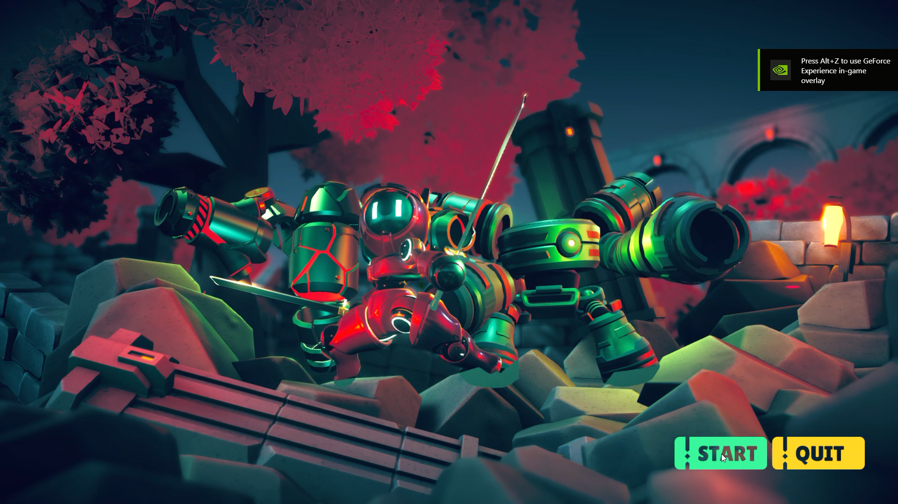
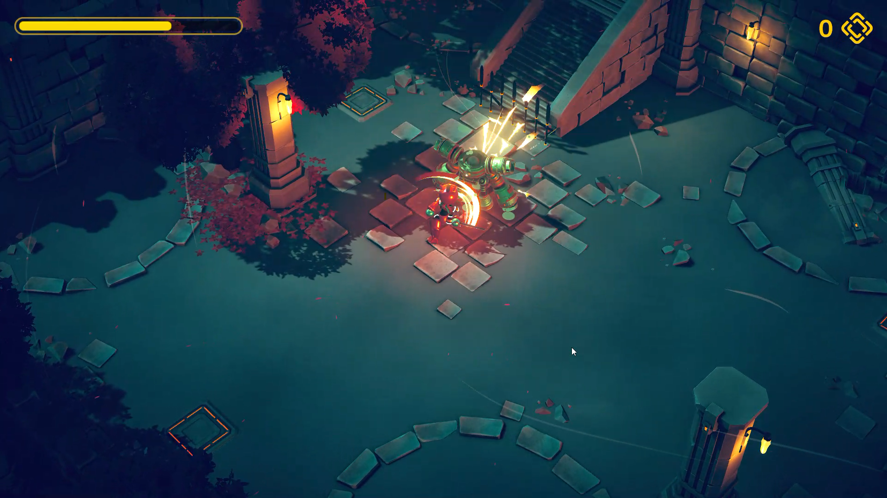
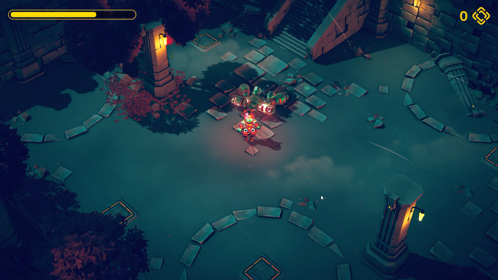
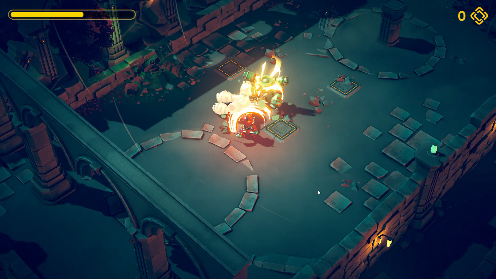
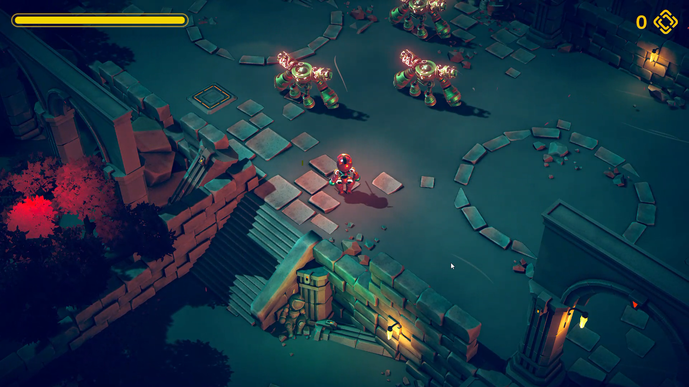
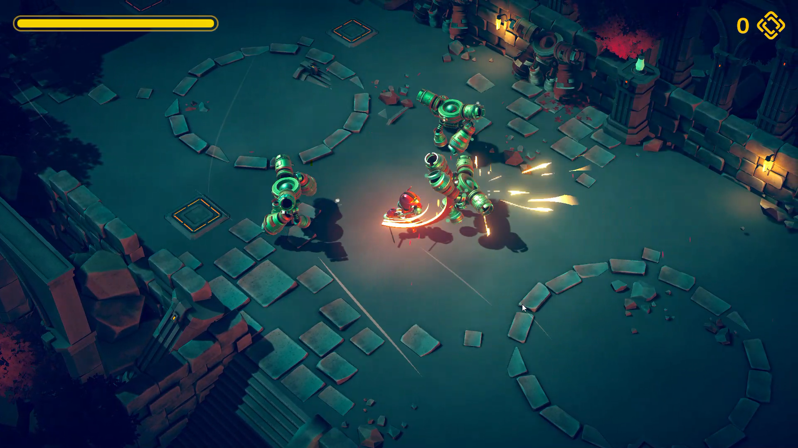
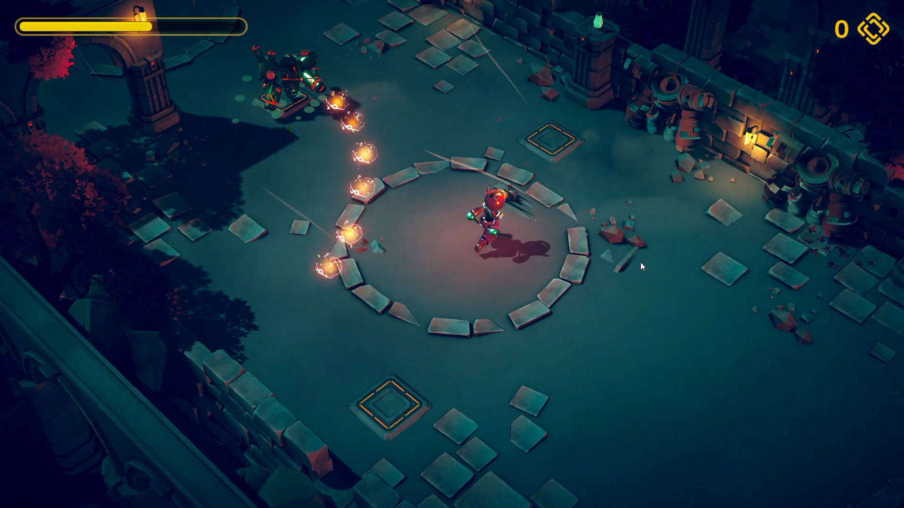
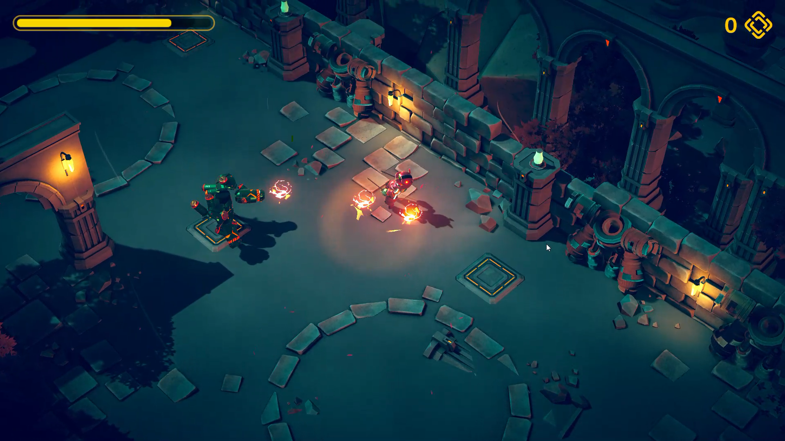

# Mech-Hunters-Blade-Quest
 
### Introduction

    A 3D action game where you step into the role of the Mech Ninja, tasked with hunting down 
    rogue mechs and their formidable bosses This project prioritizes maintaining code quality and ensuring 
    the game's adaptability for future enhancements.
    
### Features
    Visual and Audio Quality:
    - Crafted with high-quality graphics and immersive sound effects.
    
    Core Gameplay:
    - Player actions include running, rolling, and attakcking with swords.
    - Three types of attacks:
       - Normal Attack (first sword attack) (Left click).
       - 2-step Combo Attack (first and then second sword attack) (Left click -> Left click).
       - 3-step Combo Attack (first and then second sword attacks) (Left click -> Left click -> Left click).
       - Dash Attack (slide forward and attack from a distance) (Right click).

    Healing Orbs:
    - Defeating enemies causes them to drop healing orbs that restore the player's health.
    
    Enemy AI:
    - Enemies spawn as you enter their area, and they patrol the vicinity. They will chase you when detected,
      attacking until you are defeated.
    
    Boss Fight:
    - The boss enemy launches a barrage of fire orbs that players must skillfully evade to minimize damage.
    
    Smooth Camera Follow:
    - A smooth camera system ensures seamless tracking of the player's movements.
    
    User Interface (UI):
    - Visually appealing Main Menu, Pause Menu, Game Over, and Level Complete screens.
    - The Pause screen offers convenient options for resuming the game or quitting.
    
### Screenshots
  
  
  
  
     
  
  
  

  
### Code Structure and Game Design
#### Code Structure

    MVC-S (Model-View-Controller-Service):
        - The codebase is organized using the Model-View-Controller-Service (MVC-S) architectural pattern.
        - This approach maintains a clear separation of concerns:
           - The Model manages data.
           - The View is responsible for UI-related tasks and input handling.
           - The Controller is responsible for updating both the View and Model.
        - Classes for Player, Enemy, Pickups(Healing Orb), DamageOrb(FireOrb), GameManager, GameUI, Level, 
          Score have been implemented following the MVC pattern.

    Singletons:
        - Centralized control is ensured through the implementation of Singleton patterns.
        - Essential services such as PlayerService, EnemyService, PickupsService(Healing Orb), 
          DamageOrbService(FireOrb), GameService, GameUIService, LevelService, are designed as Singletons.
          
    State Pattern:
        - Utilized the state pattern to manage player and enemy states.
          - Player States : Idle, run, roll, attack, dash attack, hurt, and death.
          - Enemy States: Idle, run, patrol, pursue, hurt, attack and death.
    
    Observer Pattern:
        - Employed the observer pattern to decouple classes and facilitate event handling for events such as 
          player death, enemy hit, enemy death, and enemy group death.
        - This facilitates the activation of the game over screen and the opening of the gate when the enemy 
          group is defeated.

    Scriptable Objects:
         - Scriptable objects were utilized to configure player and enemy data, providing a flexible and 
           efficient approach for handling their attributes.
       
#### Performance Optimization:
    - To optimize performance, object pooling is implemented for enemies, damage orbs, pickups, and various 
      VFX, effectively managing memory and CPU usage.

#### Level Design:
    - Used high-quality graphics elements and integrated top-tier character models for both players and 
      enemies, including the boss character.
    - Strategically positioned enemy spawners and their respective regions in the game.

#### Enchanced Camera Tracking
    - Employed Cinemachine to smoothly follow the player. 

#### Animations:
    - The Player Animator handles character animations such as Idle, Run, Roll, attack, and Hurt.
    - The Enemy Animator, derived from the Player Animator, handles animations such as idle, run, and attacks.
    
### Focus
    - Code Quality and Organization.
    - Architecture Design for Flexibility and Scalability.
    - Visually appealing with high-quality 3D graphics and immersive sound effects.
    
### Gameplay Demonstration
   For a visual demonstration of the gameplay, watch video on YouTube. 
    
### Play the Game
   - To experience the game firsthand, play it directly by following this playable link : [Play on itch.io](https://rahul-pargi.itch.io/mech-hunter/)
   
   - For the best performance, play it via the .exe file : [Download .exe](https://drive.google.com/file/d/1vTkCpfYoJgEkJ8K7jl8uQmJh42NtcSnI/view?usp=sharing/)
    

### Credits
#### Assets
   - Character Models and Game Map: [Single-minded Ryan](https://www.udemy.com/user/single-minded-ryan/)
